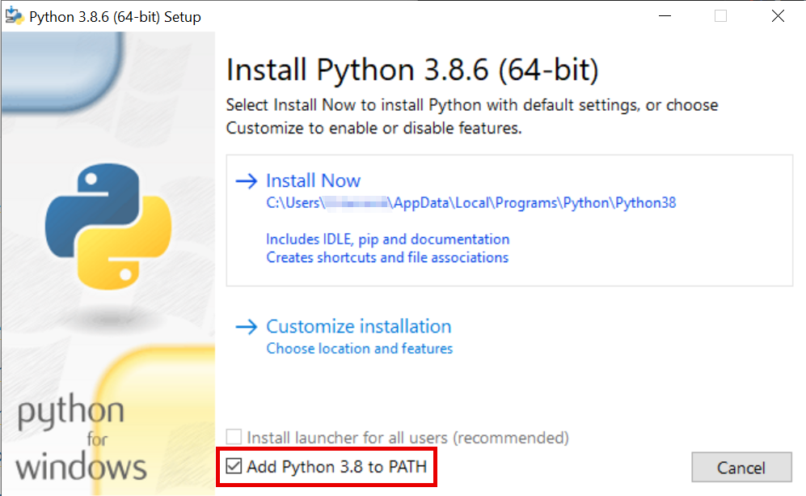

# Introduction to Jupyter Notebooks

This repository contains a tutorial on how to use Python and
[Jupyter](https://jupyterlab.readthedocs.io/en/stable/) notebooks for
interactive computing. The tutorials are written in JupyterLab notebooks
themselves, so if you want to follow along, it is recommended to [install
JupyterLab locally](#Installation).

If you just want to play around a bit, there are hosted online versions which you can [try out
here](https://mybinder.org/v2/gh/jupyterlab/jupyterlab-demo/3818244?urlpath=lab/tree/demo).


## Installation

In order to run the Jupyter notebooks for this tutorial, you need to have Python 3.8 installed. If you do not have it installed, download it here:

### Windows
* https://www.python.org/ftp/python/3.8.6/python-3.8.6-amd64.exe

Make sure you select the _Add Python 3.8 to PATH_ option during installation:



### MacOS
* https://www.python.org/ftp/python/3.8.6/python-3.8.6-macosx10.9.pkg

### Linux
* Use your distribution's package manager (search for `python3.8`, `python38`, ...)

## Python Virtual Environments

We will be creating a virtual environment (see
[here](https://realpython.com/python-virtual-environments-a-primer/) for more
info) for this tutorial to make sure we are not braking any of your existing
Python installations. For this, we will be using a tool called `pipenv`.

### Install `pipenv`

`pipenv` is just another Python  package, so you can install it by running

```
pip install pipenv
```

in a terminal.

### Create Virtual Environment

In the `pipenv` world, virtual environments are _project-based_. The
information about the environment (required Python version, dependencies, ...) is
stored in a text file called _Pipfile_ within the project directory.

To create the virtual environment for this tutorial, **make sure you are in the directory of this repository** and run

```
pipenv install
```

This will look for the _Pipfile_, create a new virtual environment using the
specified Python version and install all package dependencies.

After the installation is completed, there are basically two ways to interact with your new environment:
* `pipenv run`: run a given command inside the virtualenv
* `pipenv shell`: spawn a subshell with the virtualenv activated (can be deactivated with `exit`)

## Start JupyterLab

Finally, start JupyterLab inside of your new virtual environment with

```
pipenv run jupyter lab
```

This should automatically open up a new tab in your default browser, presenting you the JupyterLab start page. You can ignore the terminal window from now on, it's just the server running in the background.
