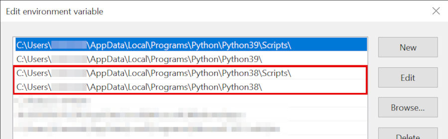

# Introduction to Jupyter Notebooks

This repository contains a tutorial on how to use Python and
[Jupyter notebooks](https://jupyterlab.readthedocs.io/en/stable/user/notebook.html) for
interactive computing. The tutorials are written in Jupyter notebooks
themselves, so if you want to follow along, it is recommended to [install
JupyterLab locally](#Installation).

If you just want to play around a bit, there are hosted online versions which you can [try out
here](https://mybinder.org/v2/gh/jupyterlab/jupyterlab-demo/3818244?urlpath=lab/tree/demo).


---

## Installation

In order to run the Jupyter notebooks for this tutorial, you need to have Python 3.8 installed. If you do not have it installed, download it here:

### Windows
* https://www.python.org/ftp/python/3.8.6/python-3.8.6-amd64.exe

Make sure you select the _Add Python 3.8 to PATH_ option during installation:


Note: this will _prepend_ the Python 3.8 paths to your `PATH`, i.e. this will
essentially become the default Python version inside your shell. For example,
when you run a script from the command line with `python my_script.py`, the
directories in `PATH` will be searched for the `python` executable and the
first match is used.

In case you have a different Python version installed and depend on it being
the default, you might want to change the order of your `PATH` entries
(Windows Key > Edit the System Environment Veriables > Environment
Variables... > Edit your User _Path_ variable), e.g.



### MacOS
* https://www.python.org/ftp/python/3.8.6/python-3.8.6-macosx10.9.pkg

### Linux
* use your distribution's package manager to install Python 3.8 (search for `python3.8`, `python38`, ...)
* run `python3.8 -m ensurepip --user` to ensure you have the corresponding pip version installed

---

## Python Virtual Environments

In order not to break any of your existing Python installations, we will be
creating a virtual environment for this tutorial using a tool called
`pipenv`. `pipenv` is just a Python package itself, so you can install it
into your Python 3.8 distribution by running

```
pip3.8 install pipenv
```

in a terminal. 

In the `pipenv` world, virtual environments are _project-based_. The
information about the environment (required Python version, dependencies,
...) is stored in a text file (_Pipfile_) within the project directory.

To create the virtual environment for this tutorial, **make sure you are in
the directory of this repository** and run

```
pipenv install
```

This will create a new virtual environment using the correct Python version
and install all package dependencies.

Once the environment is successfully created, there are basically two ways to interact with it:
* `pipenv run`: run a given command inside the virtualenv
* `pipenv shell`: spawn a subshell with the virtualenv activated (can be deactivated with `exit`)

Note that these commands should always be executed from within the project
directory (i.e. the directory that contains the Pipfile).

---

## Start JupyterLab and Run Your First Notebook

Finally, start the JupyterLab server inside of your new virtual environment with

```
pipenv run jupyter lab
```

This will start an instance of the Juypter server and automatically open up
the JupyterLab start page in your browser. We will only be interacting with
the browser front-end from now on but you need to leave the server running in
the background.

Using the file browser in the left pane, navigate into the `notebooks/`
directory and open up the `0_notebooks.ipynb` file.
